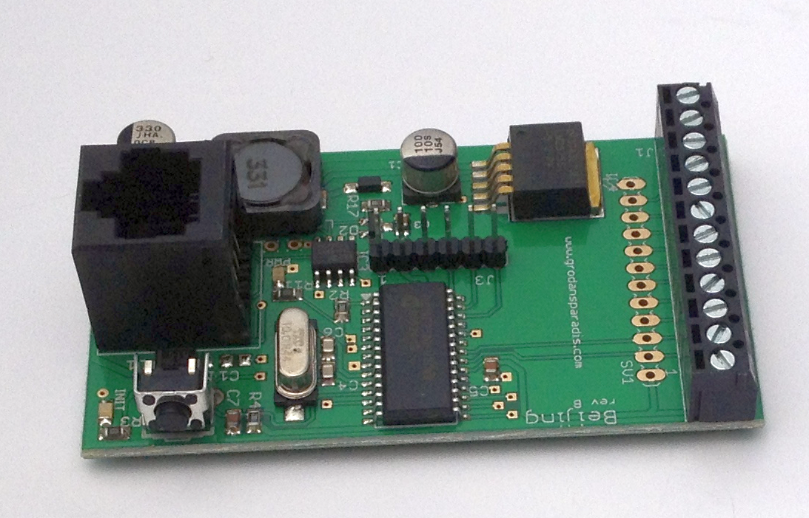

<h1>CAN4VSCP Beijing module</h1>

 

Beijing is a general I/O module that connects to a CAN4VSCP bus and can handle general I/O on ten channels that individually can be set as input or output. The module can be attached to a standard DIN Rail or be mounted directly on a wall (ordered as separate versions).

The module fully adopts to the CAN4VSCP specification and can be powered directly over the bus with a 9-28V DC power source. It has a rich register set for configuration and any information events defined. It also have a decision matrix for easy dynamic event handling.

VSCP CAN modules are designed to work on a VSCP4CAN bus which use ordinary RJ-45 connectors and is powered with 9-28V DC over the same cable. This means there is no need for a separate power cable. All that is needed is a CAT5 or better twisted pair cable. Buss length can be a maximum of 500 meters with drops of maximum 24 meters length (up to a total of 120 meters). As for all VSCP4CAN modules the communication speed is fixed at 125 kbps.

All VSCP modules contains information of there own setup, manual, hardware version, manufacturer etc. You just ask the module for the information you need and you will get it.

When they are started up they have a default functionality that often is all that is needed to get a working setup. If the module have something to report it will send you an event and if it is setup to react on a certain type of event it will do it's work when you send event(s) to it. 

This project is part of the <a href="http://www.vscp.org">VSCP (Very Simple Control Protocol) project</a>. 

## Project files

### User manual
  * [User Manual](https://grodansparadis.github.io/can4vscp_beijing/#)

### Schematic, PCB, 3D files etc
  * [Schematics reversion B](https://raw.githubusercontent.com/grodansparadis/can4vscp_beijing/refs/heads/master/images/beijing_sch_rev_B.png)
 * Hardware design files is made in [KiCad](https://kicad.org) and can be found in the `kicad` directory. Valid from reversion B of the hardware.
   * Gerber files for PCB production can be found in the `gerber` directory (in the `kicad` folder).
 * Eagle schema and board files for reversion A and B can be found in the `eagle` directory. They are no longer actively updated.

 ### Firmware

 The firmware is developed in [MPLAB X IDE](https://www.microchip.com/mplab/mplab-x-ide) using the [XC8 compiler](https://www.microchip.com/mplab/compilers).

  * Binary release files is available [here](https://github.com/grodansparadis/can4vscp_beijing/releases)

### MDF - Module Description File(s)
  * [MDF file version: 9 Release date: 2020-05-14](http://www.eurosource.se/beijing_2.xml)
  * [MDF file version: 1.0.0 Release date: 2015-06-15](http://www.eurosource.se/beijing_1.xml)

### Support
If you need support, please open an issue in the [GitHub repository](https://github.com/grodansparadis/can4vscp_kelvin_ntc10k/issues).

### Buy a ready made modules
You can buy a ready made module from [Grodans Paradis](http://www.grodansparadis.com).

### Project related links
  * [VSCP project](https://www.vscp.org)
  * [VSCP Documentation site](https://docs.vscp.org/)
  * [VSCP Wiki](https://github.com/grodansparadis/vscp/wiki)
